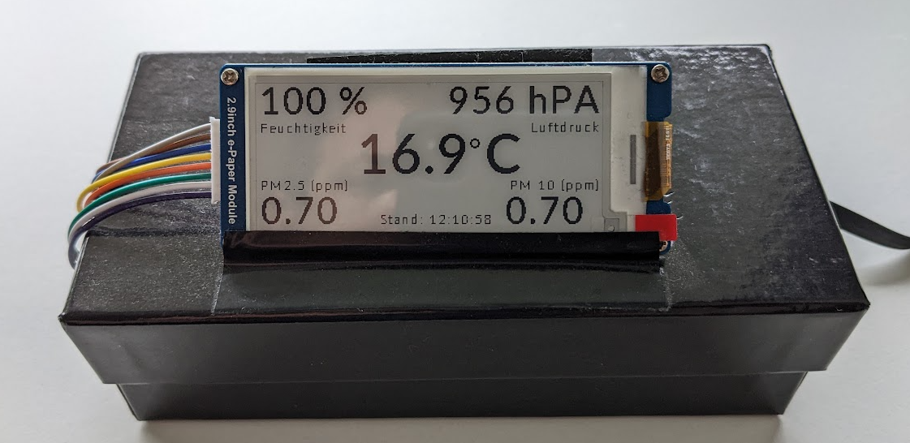
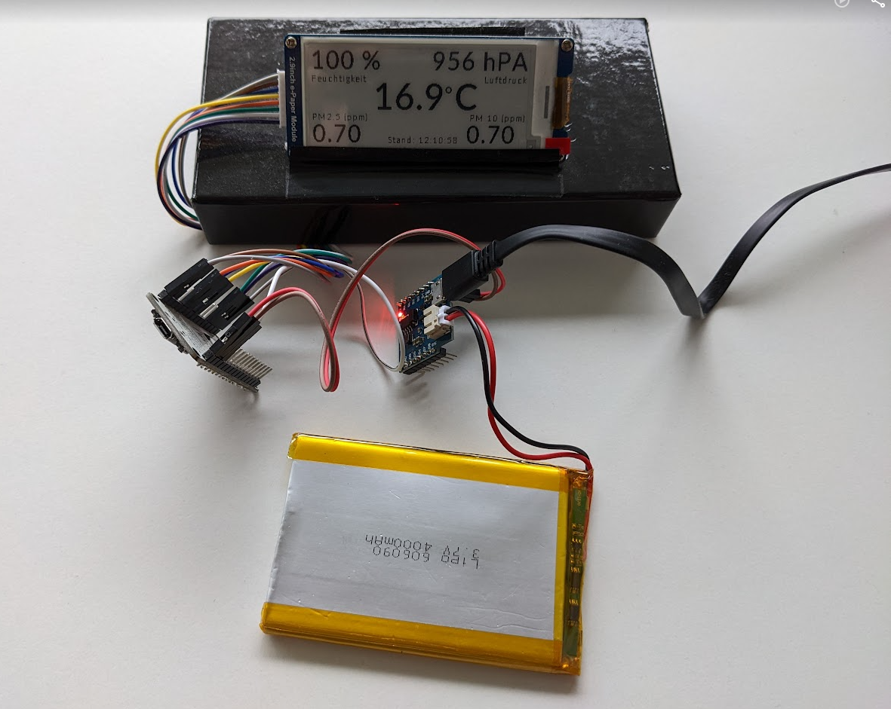

# sensor.community / E-Ink Display
An E-Ink display based on NodeMCU showing data from a local 
[sensor.community environment sensor](https://sensor.community/en/sensors/airrohr/).

Using deep sleep to reduce power consunption and enable to be run off-grid (e.g. with a solar panel).

## Hardware
- NodeMCU (ESP8266)
- 2.9 '' Waveshare E-Paper display Kit (296x128px), black/white (SPI)
- (opt) battery shield (e.g. AZDelivery D1)
- (opt) battery
- (opt) solar panel
- jump wires

## Wiring
Connect the SPI interface of the display to the MCU:
- BUSY -> D2
- RST -> D1 (!)
- DC -> D3
- CS -> D8
- CLK -> D5
- DIN -> D7
- GND -> GND
- 3.3V/VCC -> 3.3V

connect the NodeMCU RST pin to D1 to provide wake up from deep sleep

## Get it up
- Clone the reposiory or download the files
- Open in Arduino Editor
- Update the information in "arduino_secrets.h"
  - provide the SSID and password of your wifi network
  - replace the IP of the sensor with the one in your network
- Flash it on the NodeMCU
- Power it up

## Power
The display will update every 10 minutes, between the updates it goes to "deep sleep" to preserve energy. 
This way, using a battery (e.g. a 4000mAh) and a small solar panel this thing can run without an external power supply. 

